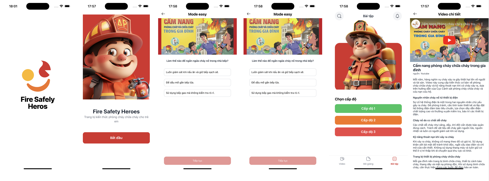

# Phòng Cháy - Kỹ Năng An Toàn Cháy

## Mô Tả:
Phòng Cháy là một ứng dụng di động được thiết kế để giáo dục người dùng về các kỹ năng an toàn cháy, từ cơ bản đến nâng cao. Ứng dụng cung cấp trải nghiệm học tập toàn diện thông qua các video hướng dẫn, bài học chi tiết và các bài kiểm tra tương tác.

Phòng Cháy hoạt động tốt trên cả thiết bị iOS và Android.

**Các Tính Năng Chính:**
- Người dùng có thể xem các video hướng dẫn phòng cháy được chọn lọc hàng tháng.
- Người dùng có thể truy cập các bài học bao gồm cả nội dung video và thông tin viết chi tiết.
- Các bài tập thực hành có sẵn dưới dạng các bài kiểm tra với ba cấp độ khó khác nhau.

## Công Nghệ Sử Dụng:
* [React Native:](https://reactnative.dev/) Một framework hỗ trợ xây dựng ứng dụng di động đa nền tảng, đảm bảo trải nghiệm liền mạch trên cả thiết bị iOS và Android.
* [Redux Toolkit:](https://redux-toolkit.js.org/) Một thư viện quản lý trạng thái ứng dụng một cách hiệu quả, cho phép dễ dàng mở rộng và bảo trì logic trạng thái phức tạp của ứng dụng.
* [nativewind:](https://nativewind.dev/) Một framework CSS theo kiểu utility-first cho React Native, cho phép thiết kế và tạo kiểu giao diện người dùng của ứng dụng một cách nhanh chóng.
* [expo-router:](https://expo.dev/router) Một thư viện định tuyến cho các ứng dụng Expo giúp đơn giản hóa điều hướng và xử lý URL, làm cho việc quản lý các màn hình ứng dụng và liên kết sâu trở nên dễ dàng hơn.

## [Cài Đặt](https://drive.google.com/file/d/1InLIHxG_A2SMXYC8bMfvmKvZ0uMRdXOm/view?usp=sharing/)

# Demo
[(./)](https://firebasestorage.googleapis.com/v0/b/food-donation-98ef2.appspot.com/o/record.mp4?alt=media&token=646d531b-6d73-4319-9541-f73de4ecbe40)